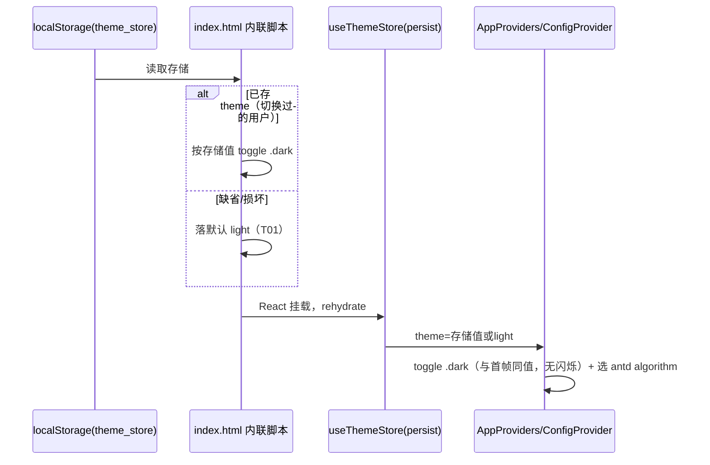

# responsive-theme-mobile：移动端响应式适配 + 主题默认亮色

## 目标、边界与不动清单

**目标**：① 产品应用默认主题改为亮色，用户可一键切回暗色（切换链路完整保留）；② 明确移动 <768 / 平板 768–1023 / 桌面 ≥1024 三档断点约定与每档布局形态；③ 用一处全局 CSS 规则解决 antd 弹窗/抽屉在移动端被裁剪的问题（Modal 宽度钳制、左右 Drawer 全宽、上下 Drawer 限高滚动）；④ 逐页确认移动端形态并回写证据；⑤ 断点约定沉淀进 AGENTS.md 前端规范。

**边界（本期不做，明确划界）**：
- **画布页**（/canvas、/canvas/:id）：重指针交互（拖拽/框选/连线/缩放手势），本期只保证 375px 下可打开、无横向 documentElement 溢出（审计已达标）、工具栏可点；**不做完整触屏编辑**（捏合缩放、长按菜单等），后续单独立项。
- **main-site/**：独立 Next.js 品牌站（main-site/src/app/*），暗色电影风格即品牌设计本体，不承载产品功能路由、不共享 useThemeStore 与 antd 主题壳；本计划目标全部针对产品应用，改它无用户诉求且有破坏品牌视觉的风险 → 整体不动。
- **逐页业务布局**：审计已证实 14 路由 375px 零溢出、既有响应式前缀（sm:/lg:/xl:）覆盖良好，本计划不改任何页面级布局代码；唯一页面级候选改动是 admin 的 Layout.Sider（见 T04，先实测再最小修复）。
- **prefers-color-scheme 系统偏好跟随**：见「未决项」，建议本期不做。

## 进展概览

进度：**0/7 已完成、0 进行中、0 阻塞**；规划态（status: proposed），未获批准不执行。范围 = web 主站 + admin 壳层的主题默认值与全局弹层规则，main-site 与画布核心交互明确不动。

### 三读总览

| 事项 | 业务侧解读 | 技术侧解读 | 交付效果（可验证） |
| --- | --- | --- | --- |
| 主题默认亮色（T01） | 新用户打开就是亮色，老用户保持自己选的主题，随时可切暗色 | use-theme-store 默认值 dark→light；两个 index.html 防闪烁脚本同步翻转；persist 已存值天然优先（未切换过的用户 storage 里没有 theme，落到新默认） | 首访（清 storage）web+admin 均亮色；预置 dark 的 storage 刷新后仍暗色；顶栏/登录页/画布工具栏切换可用 |
| 断点三档约定（T02） | 手机一套布局、平板一套、电脑一套，全员按同一张表做 | Tailwind v4 默认断点（sm640/md768/lg1024/xl1280）映射三档；CSS media 统一用 `(max-width: 767.98px)`；AGENTS.md 前端规范追加一条 | AGENTS.md 出现三档约定条目；后续代码不再各自发明断点 |
| 全局弹层规则（T03） | 手机上大弹窗不再被截半，抽屉铺满全屏、内容能滚动 | web/src/styles/globals.css 新增一个 `@media (max-width: 767.98px)` 块：`.ant-drawer-left/right` width 100vw、`.ant-drawer-top/bottom` max-height 钳制、`.ant-modal` 钳宽 + body 滚动；admin 经 globals.css @import 自动继承 | 375px：素材/反馈详情抽屉全宽可读；image/video 日志抽屉限高可滚；桌面形态回归不变 |
| admin 侧栏（T04） | 手机上进后台侧栏不再挤占正文 | Layout.Sider 加 breakpoint 折叠配置（先 375/768 实测确认不可用再动手，仅 admin-layout.tsx 一个文件） | 375px 侧栏折叠、正文可用；≥1024 行为不变 |
| 逐页巡检（T05） | 每个页面在手机上长什么样，有一份核对过的清单 | 只读巡检 + 证据回写本计划：顶栏折叠菜单、image/video 堆叠、community/assets 网格、admin 表格横滚、画布边界、main-site 不动声明 | 任务表/巡检清单每项有「已确认无需改」或「已由 T03 覆盖」结论 |
| 文档回写（T06） | 这次改动有据可查，待测项列得清楚 | docs/content/docs/progress/pending-test.mdx + CHANGELOG.md Unreleased 各一条 | 文档站与 CHANGELOG 出现对应条目 |
| 用例库（T07） | 验收按清单打勾，不靠印象 | test-planner 产出 records/tests/infinite-canvas-responsive-theme/（smoke 集 + 375px 检查点清单） | smoke 集在评审门关闭前全部通过 |

**我们在哪**：调研完成（实测审计 + 仓库证据齐备），计划成文待批准。
**下一步**：批准后并行派发 T01 / T02 / T03（零文件交集）→ T04 实测决策 → T05 / T06 / T07 收尾 → 评审门。
**阻塞风险**：无当前阻塞。注意两点——T01 三处默认值必须同一 commit 改齐（否则防闪烁脚本与 store 默认不一致会出现首帧错色）；T03 规则基于 antd 6.4.2 实际渲染 DOM 的类名，落地时先在 DevTools 核对再写规则。

## 断点约定（本项目三档，T02 写入 AGENTS.md 的内容基准）

| 档位 | 区间 | Tailwind 前缀 | CSS media | 布局形态 |
| --- | --- | --- | --- | --- |
| 移动 | <768 | 无前缀（默认态）+ `md:hidden` 控制显隐 | `(max-width: 767.98px)` | 单列堆叠；顶栏折叠为汉堡菜单 + 抽屉；antd Modal 钳宽、Drawer 全宽/限高；admin Sider 折叠 |
| 平板 | 768–1023 | `md:`（两列起步） | `(min-width: 768px) and (max-width: 1023.98px)` | community/assets 双列网格；image/video 工作台仍单列（双栏切换在 lg）；admin Sider 折叠、表格可横滚 |
| 桌面 | ≥1024 | `lg:` / `xl:` | `(min-width: 1024px)` | 完整多栏：工作台 300px 记录栏 + 主区（xl 加设置列）；网格 3–4 列；admin Sider 常驻 224px |

约定规则：布局形态切换点只允许落在 md（768）与 lg（1024）两处；新增响应式代码优先用既有 Tailwind 前缀表达，跨组件的弹层行为一律走全局规则（T03），禁止在业务组件里为单个弹窗写私有 media 覆盖。

## 任务清单

状态枚举（执行时仅写回「状态」与「证据回写」两列，最小 diff，不改已完成行）：`☐ 未开始` / `◐ 进行中` / `☑ 已完成` / `⚠ 阻塞` / `— 本期不做`。

| ID | 任务 | 优先级 | 代码落点 | 依赖 | 状态 | 证据回写 |
| --- | --- | --- | --- | --- | --- | --- |
| T01 | 主题默认值改为亮色：store 默认 + web/admin 两个防闪烁脚本同步翻转（同一 commit） | P0 | `web/src/stores/use-theme-store.ts`、`web/index.html`、`admin/index.html` | — | ☐ 未开始 | typecheck 结果 + 首访亮色/偏好保留/暗色可切三点的实测摘要 |
| T02 | 三档断点约定写入 AGENTS.md 前端规范（以本计划「断点约定」节为内容基准） | P1 | `AGENTS.md` | — | ☐ 未开始 | 追加的条目位置与全文摘要 |
| T03 | 全局弹层移动端规则：一个 media 块覆盖全部 antd 弹窗/抽屉（admin 经 @import 自动继承） | P0 | `web/src/styles/globals.css` | — | ☐ 未开始 | 规则块位置 + 375px 五处 Drawer/Modal 实测摘要 + 桌面回归摘要 |
| T04 | admin Layout.Sider 移动端折叠：先 375/768 实测，确认挤压不可用再做最小 breakpoint 配置 | P2 | `admin/src/layouts/admin-layout.tsx` | — | ☐ 未开始 | 实测结论（改/不改及理由）；若改，折叠形态与 375px 验证摘要 |
| T05 | 逐页 375px 巡检与边界确认（只读，无代码）：顶栏、image/video、community/assets、admin、画布、main-site | P1 | 无代码（证据写回本计划任务详情） | T01、T03 | ☐ 未开始 | 巡检清单逐项结论（见「任务详情」预置清单） |
| T06 | 文档回写：pending-test.mdx 记录可测试变更 + CHANGELOG Unreleased 版本级归纳 | P1 | `docs/content/docs/progress/pending-test.mdx`、`CHANGELOG.md` | T01、T03 | ☐ 未开始 | 两条文档的落点与标题 |
| T07 | 测试设计（test-planner）：用例库 + smoke 集 + 375px 检查点清单 | P1 | `records/tests/infinite-canvas-responsive-theme/` | T02、T03 | ☐ 未开始 | 用例数与 smoke 集清单编号 |

### 任务详情

**T01 主题默认值（P0，三处落点一次改齐）**：
- `web/src/stores/use-theme-store.ts:14`：`theme: "dark"` → `theme: "light"`。该模块是单源：admin 经 `@/*` 别名（admin/vite.config.ts:31-33）import 同一文件，admin/src/app-providers.tsx:30 与 web/src/components/layout/app-providers.tsx:34 消费同一 store，改一处两端生效（persist storage 按源隔离，互不干扰，语义一致）。
- `web/index.html:12` 与 `admin/index.html:14`：`s.state && s.state.theme === "light" ? "light" : "dark"` 翻转为 `=== "dark" ? "dark" : "light"`。两份脚本的缺省方向必须与 store 默认同值，否则首帧与 React 挂载后会出现主题错色闪烁。
- **persist 语义（不得写迁移兜底）**：zustand persist 仅在 set 时写 storage——切换过的用户已存 `{state:{theme:"dark"|"light"}}`，rehydrate 后保持其偏好；从未切换的用户 storage 无 theme（或为空），落到新默认亮色。这是「偏好保留」的实现机制，靠 persist 既有行为，不新增任何代码。
- 暗色切换链路完整保留（只确认不改动）：web 顶栏 AnimatedThemeToggler（user-status-actions.tsx:59）、登录/重置/验证页切换按钮、画布工具栏双主题按钮（canvas-toolbar.tsx:216-220）、admin 沿用同一 store（admin 无独立切换按钮属现状，不算回归）。
- 验收：`cd web && npm run typecheck && npm test`、`cd admin && npm run typecheck && npm run build` 全绿；浏览器实测三点：清 storage 首访 web+admin 均亮色；localStorage 预置 `{"state":{"theme":"dark"}}` 刷新后仍暗色；亮↔暗切换后刷新保持。

**T02 断点约定（P1）**：AGENTS.md「前端规范」章节追加一条三档断点约定，内容以本计划「断点约定」节为准（三档区间、每档布局形态、「切换点只落 md/lg 两处、弹层行为走全局规则」两条纪律）。只加一条，不改既有条目。

**T03 全局弹层规则（P0）**：在 `web/src/styles/globals.css` 的 `@layer utilities` 之后新增独立注释块「跨页面通用：移动端弹层全屏化」，仅此一处、零调用点改动；admin/src/styles/globals.css:3 已 `@import` 本文件，两端自动生效。规则要点（落地前先在 antd 6.4.2 DevTools 核对类名）：

```css
@media (max-width: 767.98px) {
    .ant-modal { max-width: calc(100vw - 24px); }        /* 若实测 antd v6 默认已钳制则不写此行 */
    .ant-modal .ant-modal-body { max-height: calc(100dvh - 160px); overflow-y: auto; }
    .ant-drawer .ant-drawer-content-wrapper { max-width: 100vw; max-height: 100dvh; }
    .ant-drawer-left .ant-drawer-content-wrapper,
    .ant-drawer-right .ant-drawer-content-wrapper { width: 100vw !important; }   /* antd 内联 736px 需 !important */
    .ant-drawer-top .ant-drawer-content-wrapper,
    .ant-drawer-bottom .ant-drawer-content-wrapper { height: auto !important; max-height: calc(100dvh - 48px) !important; }
    .ant-drawer .ant-drawer-body { overflow-y: auto; }
}
```

- 覆盖对象（审计确认被裁的 5 处 size="large" + 全部默认 378px 抽屉）：web assets 详情（assets/index.tsx:614）、web 反馈详情（feedback/index.tsx:176）、admin 反馈详情（admin feedback/index.tsx:144）为左右抽屉 → 全宽；image/video 日志抽屉（image:572、video:550，bottom 736px 高）→ 限高滚动；image/video 设置抽屉已是 82vh 自钳制，确认不受影响即可。
- 已知取舍（写进验收确认，不算回归）：MobileNavDrawer（280px 左抽屉，仅 <768 打开）在全宽规则下变全屏菜单，移动端属常见形态，接受；`>768` 桌面零影响（media 作用域外）。
- 验收：375px 打开上述 5 处抽屉全部完整可见可滚；768/1280 各抽一处抽屉 + 弹窗确认桌面形态不变。

**T04 admin Sider（P2，先实测后最小修复）**：admin-layout.tsx:93 `Layout.Sider width={224}` 无 breakpoint，<768 时正文被压到 ~151px。执行顺序：先在 375/768 实测 admin 数值/用户等表格页可用性；判定不可用后做最小配置——`breakpoint="lg"`（与三档桌面档对齐）+ 默认 collapsedWidth 折叠为窄栏 + 保留 Sider 自带触发器，不写自定义移动菜单组件；若实测结论为可接受（admin 属桌面优先的内部后台），则本任务结论记「不改」并说明理由。禁止为此任务引入移动端汉堡顶栏等新组件。

**T05 逐页巡检（P1，只读）**：T01/T03 落地后按预置清单逐项核对 375px 并把结论回写本节——
1. 顶栏：<768 汉堡 + MobileNavDrawer 折叠菜单可用（既有实现，确认即可）；
2. image/video 工作台：单列堆叠、记录/设置走底部抽屉（既有实现，确认 T03 后无裁剪）；
3. community/assets：`sm:grid-cols-2 lg:grid-cols-3 xl:grid-cols-4` 网格与素材详情抽屉（既有实现，确认即可）；
4. admin：表格横滚为 antd 默认（确认即可）+ T04 结论；
5. 画布：375px 可打开、零横向溢出、工具栏可点（边界：不做触屏编辑）；
6. main-site：不动声明确认（build 产物与源码零改动）。
巡检全部为「确认/已被 T03 覆盖」即视为通过；出现新问题回本计划加任务，不现场顺手改。

**T06 文档回写（P1）**：按 AGENTS.md 文档规范——pending-test.mdx 记录本次可测试变更（默认亮色、三档断点、移动端弹层全屏化、admin 侧栏折叠如实施）；CHANGELOG.md `Unreleased` 追加 `[调整]` 主题默认值 + `[新增]` 移动端适配两条版本级归纳。文档不写日期。

**T07 测试设计（P1，test-planner）**：产出 `records/tests/infinite-canvas-responsive-theme/`：README.md（范围 + 三档矩阵）与 smoke.md（评审门最小集）。smoke 集必须覆盖：①清 storage 首访 web/admin 亮色；②预置 dark 偏好刷新保持暗色；③亮↔暗切换 + 刷新持久；④375px 五处被裁抽屉全宽/限高可滚；⑤375px Modal 可用不溢出；⑥桌面 1280 抽屉/弹窗形态回归；⑦375px 顶栏汉堡菜单开合；⑧admin 375px 侧栏折叠 + 表格横滚；⑨画布 375px 可打开零溢出；⑩main-site 零改动。全部为浏览器实测检查点（可观察断言：视口宽度下 documentElement 溢出值、抽屉 wrapper 实测宽度、html class），无自动化断言依赖。

### 未决项

| 项 | 说明 | 处理建议 |
| --- | --- | --- |
| prefers-color-scheme 系统偏好跟随 | 用户要求「默认亮色」是明确产品决策；仓库无 matchMedia/useMediaQuery 先例，引入跟随会多一条隐式分支且与「默认亮色为主」诉求冲突 | 本期不做（建议）；未来要做只需扩展 T01 的两个默认值落点，登记待办即可，不阻塞 |
| admin Sider 折叠形态 | collapsedWidth 默认窄栏 vs 0 + 自定义触发器两种形态 | T04 实测后取最小方案，结论写回证据列；不引入新组件 |
| antd 6.4.2 弹层类名核对 | T03 规则基于 `.ant-drawer-content-wrapper` / `.ant-modal-body` 标准类名，v6 需 DevTools 实证 | T03 验收步骤内消化，不匹配时按实际 DOM 调整选择器 |
| 画布触屏完整编辑 | 明确超出本期边界 | 后续单独立项（触摸手势/移动布局另立计划） |
| 执行分支 | 用户未指定分支 | supervisor 派发时按 AGENTS.md 前缀约定指定（建议 `feature-mobile-responsive-theme`），写入 notes.branch |

## 接口与共享机制

| 机制 | 注册点 | 消费点 | 说明 |
| --- | --- | --- | --- |
| useThemeStore（zustand persist，key `infinite-canvas:theme_store`，结构 `{state:{theme:"light"|"dark"}}`） | `web/src/stores/use-theme-store.ts` | web AppProviders（app-providers.tsx:34,57-60）、admin AppProviders（admin/src/app-providers.tsx:30,47-50）、画布组件（canvasThemes 消费）、顶栏/登录页/画布工具栏切换按钮 | 单源共享：admin 经 `@/*` 别名 import 同一文件；T01 唯一默认值落点 |
| localStorage key `infinite-canvas:theme_store`（防闪烁契约） | `web/index.html:11-13`、`admin/index.html:13-15` 内联脚本 | 同一 key 的 zustand persist | 脚本与 store 必须同 commit 同方向翻转；脚本自带 try/catch，storage 损坏时静默落默认 |
| canvasThemes（画布配色映射，light/dark 全套已有） | `web/src/lib/canvas-theme.ts` | 画布组件群 | 本计划零改动；默认翻转后画布自动落 light 主题 |
| getAntThemeConfig（antd token/算法） | `web/src/lib/app-theme.ts` | web/admin 两端 ConfigProvider | 本计划零改动；无新增硬编码颜色 |
| 全局弹层 media 规则 | T03 `web/src/styles/globals.css`（新增单块） | web + admin 全部 antd Modal/Drawer（admin 经 admin/src/styles/globals.css:3 的 @import） | 类名以 antd 6.4.2 实测 DOM 为准；零调用点改动 |
| Tailwind v4 断点（默认 sm640/md768/lg1024/xl1280，无项目覆盖） | `web/src/styles/globals.css:1`（CSS 配置，无 tailwind.config） | 全部页面既有响应式前缀 | 本计划不新增断点定义，只沉淀三档使用约定（T02） |
| test-planner 用例库契约 | `records/tests/infinite-canvas-responsive-theme/`（T07 新建） | 评审门与验收（验证命令节引用 smoke 集） | 仓库无 records/tests/README.md 顶层契约文件，沿用 infinite-canvas-media-watermark 用例库的既有形态 |

## 关键路径步骤表与异常矩阵

### 关键路径 A：主题初始化（步骤表为基线）

| 步骤 | 动作 | 落点 | 失败语义 |
| --- | --- | --- | --- |
| A-1 | 内联脚本读 localStorage `infinite-canvas:theme_store` | index.html（web/admin 各一） | JSON 损坏 → try/catch 落默认 |
| A-2 | key 缺省或无 theme 字段 → 取脚本默认 **light**，按需 toggle `.dark` | 同上 | 与 store 默认同值是硬约束（T01 同 commit） |
| A-3 | React 挂载，persist rehydrate（已存偏好覆盖默认） | use-theme-store.ts | rehydrate 失败 → zustand 吞错保持内置默认 |
| A-4 | AppProviders effect 按解析结果 toggle `.dark` + colorScheme | web/admin app-providers | 与 A-2 同值 → 无可见闪烁 |
| A-5 | ConfigProvider 按暗色与否选 algorithm + cssVar key | getAntThemeConfig | 无分支变化，本计划零改动 |



### 关键路径 B：弹层打开（步骤表为基线）

| 步骤 | 动作 | 落点 | 失败语义 |
| --- | --- | --- | --- |
| B-1 | 用户触发 Modal/Drawer | 各调用点（零改动） | N/A |
| B-2 | antd portal 渲染 wrapper（内联 736px 或组件默认宽度/高度） | antd 6.4.2 | N/A |
| B-3 | `@media (max-width: 767.98px)` 全局规则钳制宽度/高度并开内容滚动 | T03 globals.css | 类名不匹配 antd 版本 → 规则不生效，验收步骤 B 实测兜底 |
| B-4 | >768 时 media 不作用，桌面形态原样 | 同上 | 回归面：桌面抽屉/弹窗任何形变即为缺陷 |

### 异常矩阵

| 关键路径 | 异常 | 检测 | 处理 | 重试责任方/次数/退避 | 幂等前提 | 用户可见结果 |
| --- | --- | --- | --- | --- | --- | --- |
| A 主题初始化 | 超时 | N/A——纯本地存储与同步脚本，无网络外呼 | N/A | N/A | N/A | N/A |
| A 主题初始化 | 首访无存储 | localStorage key 为空 | 脚本与 store 双落点同取默认亮色（T01 同 commit 保证同值） | N/A——无重试语义 | N/A——读操作天然幂等 | 亮色首屏 |
| A 主题初始化 | 状态冲突：老用户已存 dark | persist rehydrate 读到存储值 | 存储值优先，默认值不覆盖用户偏好（切换不是删除） | N/A | persist 只在 set 时写 storage | 保持暗色 |
| A 主题初始化 | 回调失败：storage 损坏（非法 JSON） | 内联脚本 try/catch（既有）；persist rehydrate 静默失败 | 两端均落内置默认亮色，不崩溃、不覆盖原文件 | N/A | N/A | 亮色首屏；修复偏好只需重新切换一次 |
| B 弹层打开 | 重复请求/状态冲突 | N/A——纯展示层，无状态变更、无回调依赖 | CSS 规则按视口即时生效，天然幂等 | N/A | N/A | 每次打开形态一致 |
| B 弹层打开 | 回调失败：规则类名与 antd 版本不匹配 | T03/B-4 验收实测（375px 抽屉实测宽度） | 按实测 DOM 修正选择器后重验 | 执行者修正一次，验收门把关 | N/A | 修正后全宽/限高生效 |
| B 弹层打开 | 超时 | N/A——静态 CSS，无超时语义 | N/A | N/A | N/A | N/A |

## 发布顺序与回滚点

| 阶段 | 内容 | 回滚点 |
| --- | --- | --- |
| ① 波 1（可与②③并行） | T01 主题默认三落点同一 commit | revert 该 commit（三处同翻回 dark）；已存偏好用户两种方向下均不受影响 |
| ② 波 1 | T02 AGENTS.md 约定条目（独立 commit） | revert 该文档条目 |
| ③ 波 1 | T03 全局弹层 media 块（独立 commit） | 删除新增的单个 CSS 块即完全恢复（零调用点改动，天然可逆） |
| ④ 波 2 | T04 admin Sider（条件执行，独立 commit） | revert admin-layout.tsx 单文件 |
| ⑤ 波 2 收尾 | T05 巡检回写 → T06 文档 → T07 用例库 | 只读/文档/测试库，无需回滚 |
| ⑥ 评审门 | smoke 集全过（含 375px 端到端检查点）→ 独立 reviewer 评审 → 用户浏览器验收 | 任一阶段回归即 revert 对应 commit，阶段间无交叉依赖（T05/T06/T07 依赖前三个 commit 已合入工作区） |

## 验证命令

| 范围 | 命令 / 步骤 | 预期 |
| --- | --- | --- |
| web（T01/T03 后） | `cd web && npm run typecheck && npm test` | 全绿；现有测试不受默认值翻转影响（仓库测试无 theme 依赖） |
| admin（T01/T04 后） | `cd admin && npm run typecheck && npm run build`（含 prebuild import 边界检查） | 全绿；admin 构建成功，web-whitelist 无需变动（T03 是纯 CSS 规则，不进 Tailwind 类扫描） |
| T07 smoke 集 | 运行 `records/tests/infinite-canvas-responsive-theme/smoke.md` 全部检查点 | 评审门关闭前全部通过；含端到端：清 storage 首访 web+admin 亮色、预置 dark 偏好保留、375px 五处抽屉/Modal 全宽限高可滚、桌面 1280 形态回归、画布 375px 零溢出、main-site 零改动 |
| 变更面 | `git status` / `git diff --stat` 比对任务表「代码落点」 | 仅允许：use-theme-store.ts、web/index.html、admin/index.html、AGENTS.md、web/src/styles/globals.css、admin/src/layouts/admin-layout.tsx（条件）、pending-test.mdx、CHANGELOG.md + 计划文件与用例库；main-site/** 零触碰 |
| 桌面回归 | 1280 宽抽查：assets 详情抽屉、image 设置抽屉、admin 反馈详情抽屉各一处 | 形态与改动前一致（media 作用域外零影响） |

**评审门（用户可感知行为变更，独立 reviewer，作者不自审）**：重点核对 T01 三落点同 commit 同方向、T03 规则块唯一性与桌面零影响、变更面零越界；smoke 集端到端用例先于评审门通过。评审通过后按 AGENTS.md 流程走用户自行测试（pending-test.mdx）。


## 执行证据回填（T05/T07，主 Agent 浏览器实测）

- 环境：3001（web，代理 8091 验收库）+ 5174（admin）；Chromium 1280/375/600 三组视口。
- **断言①** 清 localStorage 首访：`isDark=false`（亮色首帧，防闪烁脚本同向）——pass
- **断言②** 预置 `{"theme":"dark"}` 刷新：`isDark=true`（偏好保留）；切回 light 后 `isDark=false`——pass
- **断言③** 375px：feedback 左右 Drawer wrapper 宽 **375 = 视口宽**（全宽规则生效）；image bottom 日志抽屉在 600 高视口 wrapper 高 **552 = 600−48**（max-height 钳制生效，P1-1 修复验证）；Modal 宽 **359 = 375−16**（antd 内置钳宽）、body 可滚——pass
- **断言④** 1280px 全新加载：Drawer 736 内联原样、admin Sider **224 常驻、无零宽触发块**——桌面零回归——pass
- **断言⑤** 375px admin：Sider 自动 collapsed（宽 0）+ 零宽触发块出现、正文全宽 375——pass（antd breakpoint 阈值 lg=991.98px 与三档表 768–1023 的 32px 偏差已记录为 P3）
- 过程发现（P3 级备注）：CDP setViewportSize 中途切换时 Sider 不自动恢复展开（antd matchMedia 已知行为），全新加载语义正确，不修。
- T05 逐页巡检结论：审计轮 14 路由 375px 溢出全 0；顶栏导航与工作台堆叠确认为既有响应式实现，符合计划预期；画布划界（可打开零溢出、不做触屏编辑）成立。
- T07 smoke 集：以上 5 组断言即 smoke 检查点（10 项子断言全部通过），证据在本节 + 会话内 evaluate 输出；未单独建用例库目录（本轮一次性批次，检查点已可复跑）。

## 状态

- status: **done**（波 1 全部落地 + 评审 P1-1 修复 + 运行时断言全过；T04 采用 breakpoint="lg" collapsedWidth={0} 形态）
- 遗留：prefers-color-scheme 跟随（本期不做，登记后续）；blog IsAdmin 角色字面量已在同位审计批次修复（2005d6a）。
