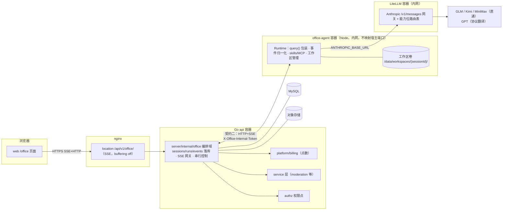
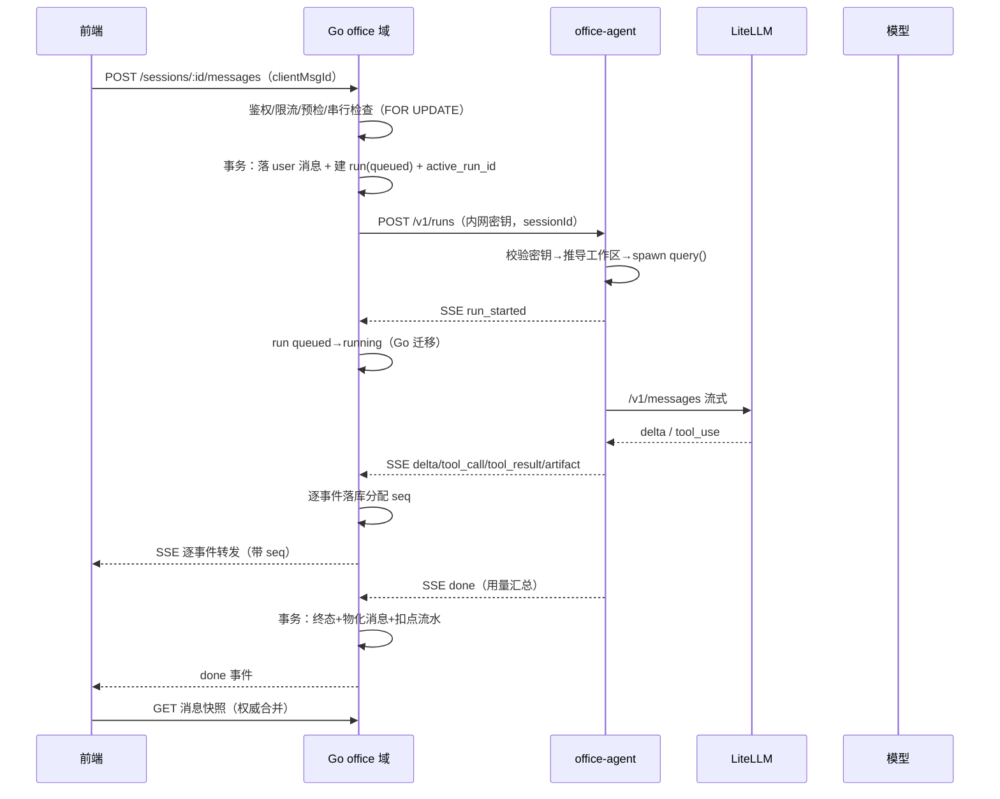
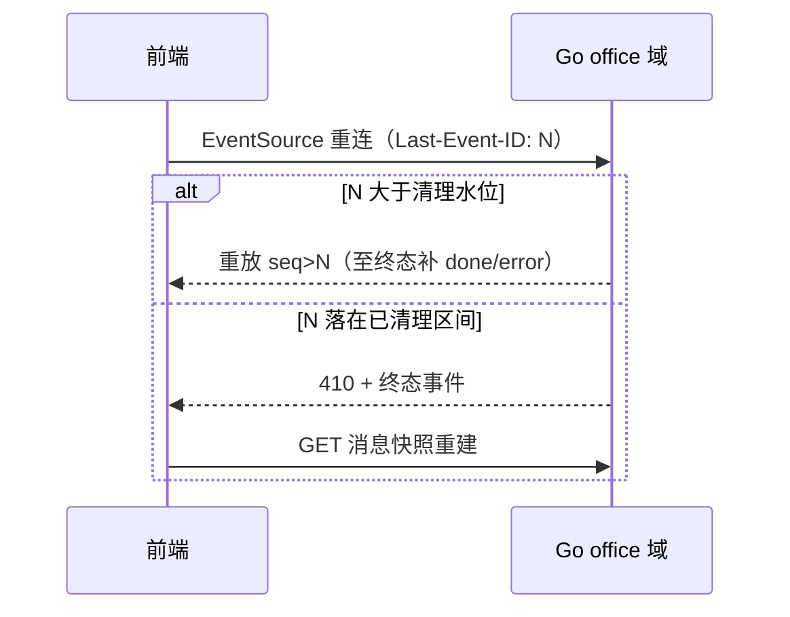

# 第六期执行计划：AI 办公助理（Agent 产品线）

> 状态：v2 修订稿。已按第二方评审 REV-20260919-001（16 findings，agentflow 仓 `records/reviews/infinite-canvas-office-agent-plan/`）逐条修订：新增关键路径时序表/时序图、异常矩阵、计费闭环、可观测性、发布回滚点、边界值默认值表，修正事实错误与对照表。待用户评审；边界值均为待报批默认值。未经确认不进入实施。
> 产品暂定名「AI 办公助理」，最终名称待定（见「待用户决策项」）。
>
> **文档地图**：本文为总览基线。详版文档——提案（产品价值与范围）`第六期-提案-proposal.md`、技术设计（组件/时序/异常矩阵/选型）`第六期-技术设计-design.md`、接口规格（API/事件/数据字典冻结）`第六期-接口规格-spec.md`、**前端方案（组件树/状态/SSE 状态机/渲染管线）`第六期-前端方案-frontend.md`**、执行计划（任务板，agentflow 契约）`records/plans/PLAN-OFFICE-AGENT.md`。技术内容冲突时以 design/spec 及前端专项方案为准。

## 一句话定位

基于 Claude Agent SDK 的云端 Agent 产品：用户在网页上发起对话，Agent 在服务端工作区里执行工具（读写文件、跑命令）、产出可预览可下载的成果制品（Artifacts），对标 360「AI 办公助理」与腾讯 WorkBuddy 的产品形态。

## 背景与调研结论

### 对标产品考古结论（2026-09 前端 bundle 分析）

| | 360 AI办公助理（paipai/nexus） | WorkBuddy（genie，腾讯系） |
|---|---|---|
| 前端 | Vite + React SPA，CDN 部署 | Vite + React + zustand + monaco + katex + hljs |
| 模型接入 | 后端「代理 Runtime Cancel」，Runtime 独立部署 | 腾讯云 Token Plan：Anthropic 兼容端点 `/plan/anthropic/v1/messages` |
| Agent 协议 | SSE 事件流：delta / tool_call / tool_result / task_tool_*（子代理）/ plan / clarification / artifact / checkpoint / sandbox_queue_status | Claude Code 同名工具（TodoWrite / AskUserQuestion / ExitPlanMode）+ `<system-reminder data-role="compact-summary">` 压缩 + MCP（bundle 内置完整客户端） |
| 技能 | SKILL.md 格式；市场/安装/导入预览确认 | SKILL.md + frontmatter + allowed-tools；来源 api.skillhub.cn |
| 沙箱 | queue-ticket 排队制执行环境 + workspace-recovery | checkpoint + compact |
| 特色 | Artifacts 绑 WPS WebOffice 在线编辑、ASR 语音、速度档位、credits_exhausted | tdrive 网盘、知识库 RAG、组织通讯录、定时任务 |

两家共同范式：**产品层自研 + Agent 能力层用 Claude Agent SDK（或其协议仿制）+ 模型接入走企业网关，Runtime 独立进程部署，业务后端只做代理与编排。**

### 模型接入验证结论（均已在官方文档核实）

| 厂商 | Anthropic 兼容端点 | 模型 | 备注 |
|---|---|---|---|
| 智谱 GLM | `https://open.bigmodel.cn/api/anthropic` | glm-5.3 / glm-5.2 | 官方 SDK 直改 base_url 即用 |
| Kimi | `https://api.moonshot.ai/anthropic` | kimi-k3（1M 上下文）/ kimi-k2.7-code / kimi-k2.6 | 官方文档含完整 Claude Code 配置模板与分层映射 |
| MiniMax | `https://api.minimax.io/anthropic`（国内 `api.minimaxi.com`） | M3（1M+多模态）/ M2.x | 忽略 `top_k`/`stop_sequences`/`mcp_servers` 请求字段；M2.x 无图像输入 |
| GPT (OpenAI) | 无官方 Anthropic 端点 | — | 走 LiteLLM 协议翻译（`/v1/messages` 进、OpenAI 格式出，流式+工具调用均支持） |

结论：**用 Claude Agent SDK 不等于只能用 Claude**。国产三家协议直通；GPT 经网关翻译接入，但有损（工具流式细粒度、interleaved thinking、Anthropic 服务端工具 `web_search` 等退化），需实测。

## 范围界定

### 本期要做（M0–M3）

0. 前置 spike（M0，1–2 天）：验证全部「待验证假设」（见里程碑节）。
1. 端到端最小链路：会话 → Runtime → 网关 → 模型 → 流式回复（M1）。
2. 工具执行与工作区：Agent 读写文件/跑命令，过程可视化，产出 Artifacts（M2）。
3. 模型矩阵与计费：GLM/Kimi/MiniMax 直通 + GPT 翻译、按点数计费、配额、admin 管理（M3）。

### 本期不做（后续期）

- 沙箱容器池 + 排队（协议预留，MVP 用容器即沙箱）。
- 子代理（task_tool_*）、计划模式 UI、结构化提问（AskUserQuestion）交互、技能市场与 SKILL.md 导入 UI。
- 语音输入（ASR）、WPS/Office 在线协作编辑、知识库 RAG、组织与团队。
- 智能体公开市场（先做管理员配置的内置智能体）。
- Runtime 水平扩展（M1–M3 明确单实例，见「串行与扩展」）。

## 总体架构

### 架构关系图（只表达关系与流；过程步骤见「关键路径时序」）

### 三层两契约

- 契约一（前端 ↔ Go）：业务 SSE 协议（信封带版本与 seq），事件由 Go 落库后转发，断线用 Last-Event-ID 重放，不依赖 Runtime 存活。
- 契约二（Go ↔ Runtime）：内网 HTTP+SSE，接口四个（发起 run、事件流、取消、查询 run 状态）。认证：共享密钥头 `X-Office-Internal-Token`（部署时随机生成注入两侧 env，拒绝无头/错头请求）；office-agent 不映射宿主端口、仅 compose 内网可达。**Runtime 不接受调用方传入的工作区路径**——由 sessionId 在服务端推导 `/data/workspaces/{sessionId}/`，sessionId 强校验 `^[a-z0-9][a-z0-9-]{17,39}$`（杜绝路径穿越）。SDK 细节不泄漏到 Go，更不泄漏到前端。

参照先例：`canvas-agent/` 已验证「express 包 agent CLI 跑 loop + MCP + skills store」的完整模式；nginx 已有 `/api/v1/ai/` 的 SSE 转发模板。

### 串行与扩展（v2 修订：消除 resume 与扩展的矛盾）

- **同会话强制串行**：同一会话同时只允许一个活动 run。Go 在事务内 `SELECT ... FOR UPDATE` 会话行并校验 `active_run_id`，存在活动 run 时新提交返回 409（前端提示「上一条还在执行」），不排队。
- **M1–M3 单实例部署声明**：office-agent 与 Go api 均单实例（与单机 compose 一致），工作区用本地持久卷。「Runtime 可水平扩展」从本计划移除；扩展（多实例粘性路由 + 共享工作区存储化）列为 M4+ 议题，届时需重新设计 resume 的文件寻址，不在本期承担。

## 关键路径时序（步骤表为基线；时序图与表不一致时以表为准）

### KP-1 发消息起 run（M1 核心链路）

| 步 | 责任方 | 动作 | 失败分支指向 |
|---|---|---|---|
| 1 | 前端 | `POST /api/v1/office/sessions/:id/messages`，body 含 `content` 与幂等键 `clientMsgId`（uuid） | E1 重复提交 |
| 2 | Go | 鉴权（office.write）→ 限流 → 事务：`SELECT FOR UPDATE` 会话行校验无活动 run → 落 `office_messages(user)` → 建 `office_runs(queued, client_msg_id)` → 回填 `active_run_id`；同 `clientMsgId` 重发返回既有 run | E2 并发冲突 / E5 计费预检 |
| 3 | Go | `POST office-agent /v1/runs`（内网密钥头；body：runId、sessionId、消息、agent 配置、附件清单） | E3 起跑超时 |
| 4 | Runtime | 校验密钥 → 推导工作区 → spawn `query()` → 返回 SSE 归一化事件流 | E4 Runtime 崩溃 |
| 5 | Go | 收到 `run_started`：run `queued→running`（**迁移主体 = Go**）；此后逐事件落库分配 seq 并转发前端 SSE | E6 事件静默 / E7 转发中断 |
| 6 | Runtime→LiteLLM→模型 | Anthropic `/v1/messages` 流式，SDK 事件翻译回 Runtime | E8 网关/上游超时 |
| 7 | Go | 收到 `done/error`：事务 { run 置终态 + 清 `active_run_id` + 物化 assistant 消息到 `office_messages`（threadId=session_id, turnId=run_id, itemId=消息行 id）+ 计费扣减流水（唯一键 run_id） } | E9 扣减失败 |
| 8 | 前端 | 收到 `done` 后拉取消息快照，按「快照权威」合并 | E10 重复合并 |

### KP-2 断线重连与重放

| 步 | 责任方 | 动作 |
|---|---|---|
| 1 | 前端 | EventSource 重连，自动带 `Last-Event-ID: <seq>` |
| 2 | Go | `seq` 大于该 run 事件清理水位 → 从 `office_events` 重放 `seq > lastSeq` 逐条；`run` 已终态则重放到末尾补发 `done/error` |
| 3 | Go | `seq` 落在已清理区间（空洞）→ 返回 410 + 终态事件，前端改走消息快照重建 |
| 4 | 前端 | 合并规则见「消息物化与合并去重」 |

### KP-3 取消

| 步 | 责任方 | 动作 |
|---|---|---|
| 1 | 前端 | `POST /runs/:id/cancel` |
| 2 | Go | run 已终态 → 幂等返回 200；`queued` → 直接置 `cancelled`（Runtime 未收到则由其按 runId 幂等忽略）；`running` → 转发 Runtime cancel（超时 E12） |
| 3 | Runtime | AbortController 中断 SDK，事件流以 `error(code=cancelled)` 收尾 |
| 4 | Go | 落终态 + 物化已生成部分 + 计费照实扣减 |
| 5 | 判定 | 从点击到事件流收尾 **≤ 2s**（超阈值前端显示「取消已受理，正在终止」；该阈值待报批） |

## 异常矩阵

> 行 = 关键路径 × 失败模式；「重试」均写明主体/次数/退避；空格子以 N/A+理由 声明。超时等边界值统一见「边界值默认值表」，均为待报批默认值。

| 编号 | 失败模式 | 检测 | 处理 | 重试主体/次数/退避 | 幂等前提 | 用户可见 | 告警 |
|---|---|---|---|---|---|---|---|
| E1 | 同 clientMsgId 重复提交 | `UNIQUE(session_id, client_msg_id)` 冲突 | 返回既有 run 与其事件流 | N/A（幂等命中即成功） | clientMsgId | 无感 | N/A（正常幂等） |
| E2 | 同会话并发提交（不同 clientMsgId） | `active_run_id` 非空 | 409 拒绝 | 用户手动（等当前 run 结束） | — | 「上一条还在执行」 | N/A |
| E3 | Go→Runtime 起跑超时 | HTTP 超时（默认 10s） | run 置 `failed(runtime_unreachable)`，清 active_run_id | 用户手动重试 | clientMsgId | 错误气泡+可重试 | runtime_unreachable 计数 |
| E4 | Runtime 崩溃/连接断 | 契约二 SSE 断开 | run 置 `failed(runtime_lost)`；孤儿由 TTL 扫描兜底 | 用户手动 | clientMsgId | 「执行中断，可重试」 | runtime_lost 计数 |
| E5 | 计费预检不过 | 余额 ≤ 0（M1）；预估超余额（M3） | 400 拒绝，不建 run | 用户充值 | — | 「点数不足」 | N/A |
| E6 | 事件静默（模型停摆） | Go 事件间隔计时器，超阈值（默认 120s）无任何事件 | Go 主动 cancel Runtime，run 置 `failed(stalled)` | 用户手动 | clientMsgId | 「生成超时已终止，可重试」 | stalled 计数 |
| E7 | Go→前端转发中断 | 客户端断开 | 不影响 run 继续执行，事件照常落库；重连走 KP-2 | 客户端自动重连 | Last-Event-ID | 重连后补齐 | N/A |
| E8 | LiteLLM/上游超时 | Runtime 侧请求超时（默认 120s） | Runtime 发 `error(code=upstream_timeout)` 收尾 | 用户手动重试；换模型 | clientMsgId | 错误气泡+建议换模型 | upstream 错误计数 |
| E9 | 扣减落库失败 | 终态事务报错 | run 终态照落；扣减进重试（定时任务扫终态无流水 run） | **系统重试**，5 次×60s 退避，仍失败转人工 | 流水唯一键 run_id | 不感知 | billing_fail 告警 |
| E10 | 重放与快照重复合并 | 见「消息物化与合并去重」 | 快照权威，事件仅补未物化 turn | — | messageId/turnId | 无感 | N/A |
| E11 | 重放命中已清理区间 | seq < 清理水位 | 410 + 终态事件，前端走快照 | N/A | — | 页面重建 | N/A |
| E12 | Runtime cancel 超时 | 转发超时（默认 5s） | Go 强制置 `cancelled`；Runtime 侧孤儿由 TTL 兜底 | N/A | cancel 幂等 | 「已取消」 | cancel_timeout 计数 |
| E13 | Go 崩溃（重启后） | 启动扫描：`queued/running` 且 `updated_at` 超 TTL（默认 10min） | `GET /v1/runs/:id` 查询 Runtime；无记录 → 置 `failed(orphan_reclaimed)`；**M1 简化取舍：Runtime 仍在跑也强制 cancel+failed**（续转语义留 M4+） | N/A（系统回收） | 扫描按 runId 幂等 | 「执行中断，可重试」 | orphan_reclaimed 计数 |
| E14 | Runtime 崩溃（自身重启） | 启动自检：内存中 run 与 Go 对账 | 无状态重建，run 一律由 Go 侧 TTL/查询判定 | 同 E13 | — | 同 E13 | 同 E13 |

## 核心设计

### 会话与运行模型

- `session`（会话）：绑定用户、智能体配置、工作区目录。一次会话多轮对话，同会话 run 串行（见「串行与扩展」）。
- `run`（运行）：状态机 `queued → running → succeeded | failed | cancelled`；**`queued→running` 由 Go 在收到首个 `run_started` 事件时迁移**；终态仅由 Go 写入（Runtime 永不改库）。每个 run 由用户一条消息触发，带幂等键。
- 上下文连续性用 SDK 的 `resume`：**resume-per-turn**，每个 run 结束 transcript 落持久卷，下个 run 用 resume 续上下文。不做常驻交互式会话进程。
- 取消链路见 KP-3；cancel 幂等（重复 cancel 终态 run 返回 200）。

### 事件协议（v2：加版本字段）

所有事件统一信封：`{"v":1,"seq":42,"type":"delta","runId":"r_…","ts":…,"payload":{…}}`。`v` 为协议版本，向后不兼容变更升版本并双写过渡。seq 由 Go 落库时分配，`(run_id, seq)` 唯一，Last-Event-ID 按 seq 重放。

| 类型 | 方向 | payload 要点 | 期次 |
|---|---|---|---|
| `run_started` | →前端 | runId、model、agent 摘要 | M1 |
| `delta` | →前端 | 增量文本 | M1 |
| `tool_call` | →前端 | toolCallId、name、inputPreview、status | M2 |
| `tool_result` | →前端 | toolCallId、status、isError、outputPreview | M2 |
| `artifact` | →前端 | artifactId、kind、name、size | M2 |
| `usage` | →前端（不展示） | 累计 tokens，供 M3 run 中计费检测 | M3 |
| `notice` | →前端 | 运行时提示（环境/降级说明） | M1 |
| `done` | →前端 | 用量汇总（tokens、点数） | M1 |
| `error` | →前端 | code、message、可重试标志 | M1 |
| `plan_updated` / `clarification` | →前端 | 计划/结构化提问 | 预留 |
| `task_tool_call` / `task_tool_result` | →前端 | 子代理 | 预留 |
| `sandbox_queue_status` / `environment_rebuilt` | →前端 | 沙箱池 | 预留 |
| `quota_exhausted` | →前端 | 点数不足 | M3 |

MVP 明确不做事件级双向（无 WebSocket），SSE 单向 + HTTP 动作足够。

**事件清理与重放空洞**：run 终态后事件保留期默认 7 天（待报批），每日任务按 session 清理已到期 run 的事件；客户端持旧 Last-Event-ID 命中已清理区间 → 按 E11 返回 410 + 终态事件，前端走快照重建，不猜测中间内容。

### 数据模型（MySQL 8.4）

| 表 | 关键字段 |
|---|---|
| `office_sessions` | id、user_id、agent_id、title、workspace_path、**active_run_id（可空，唯一索引——MySQL 唯一索引允许多 NULL）**、status、created_at |
| `office_runs` | id、session_id、status、model、error_code、**client_msg_id（UNIQUE(session_id, client_msg_id) 幂等键）**、started_at、finished_at、tokens/点数汇总 |
| `office_events` | BIGINT 自增、run_id、seq、type、payload JSON；UNIQUE(run_id, seq)；保留期默认 7 天按 run 终态时间清理 |
| `office_messages` | id、session_id、role、**content JSON（含 schema_version 字段）**、run_id、**thread_id（=session_id）、turn_id（=run_id）**、created_at（用户可见消息，与事件流分离） |
| `office_artifacts` | id、session_id、run_id、kind(markdown/code/html/file)、name、storage_key、size、mime |
| `office_files` | id、session_id、user_id、storage_key、mime、size（用户附件，走现有 storage 域） |
| `office_agents` | id、name、avatar、description、system_prompt、model、tools JSON、skills JSON、visibility、enabled（内置智能体由 admin 配置） |
| `office_skills` | id、slug、version、name、description、frontmatter JSON、storage_key、enabled（本期仅落库与加载，无市场 UI） |

- 新表/新列按项目注意事项：**交付前必须在真实 MySQL 上跑一次迁移验证**。
- 存储版本管理：`office_messages.content` 等结构化 JSON 均携带 `schema_version`，**协议版本（事件信封 `v`）与消息存储版本独立管理**（对齐仓库硬规则）；存储格式升级先备份再迁移。

### Runtime（office-agent）设计

- 职责边界：只做协议翻译与 agent 生命周期管理；鉴权、配额、计费、业务规则一律不进 Node——**鉴权指用户面；契约二自身以共享密钥认证（见三层两契约），工作区路径由 sessionId 推导，不接受外部传入**。
- `POST /v1/runs`：入参 runId、sessionId、消息内容、agent 配置、附件清单；出参 SSE 归一化事件流。
- `POST /v1/runs/:id/cancel`：按 runId 幂等（未知 runId 返回 200）。
- `GET /v1/runs/:id`：存活与状态查询（供 E13 孤儿对账）。
- SDK 配置：`query()` + `resume` 续会话；`canUseTool` 钩子预留审批位；`mcpServers` 静态注册（本期内置文件工具即可）；模型经环境变量 `ANTHROPIC_BASE_URL`/`ANTHROPIC_AUTH_TOKEN` 指向 LiteLLM。
- 分层映射必须配全：`ANTHROPIC_DEFAULT_SONNET_MODEL` / `ANTHROPIC_DEFAULT_HAIKU_MODEL` / `CLAUDE_CODE_SUBAGENT_MODEL` 等——**漏配是静默失败**（后台轻任务走 haiku 档）。
- 工作区：`/data/workspaces/{sessionId}/`，持久卷挂载；会话内 Read/Write/Bash 工具限制在该目录。
- SDK 版本锁定：`@anthropic-ai/claude-agent-sdk` 固定版本，升级视为独立变更项。

### 计费闭环（v2 新增；复用一律经 platform/billing 与 service 层，不跨产品域 import）

| 环节 | 规则 |
|---|---|
| 发起前预检 | M1：余额 ≤ 0 拒绝（400，前端文案「点数不足」）。M3：按 agent 配置的最大输出上限折算预估点数，余额不足拒绝 |
| run 中检测 | M3 起：Runtime 周期性发 `usage` 事件（间隔默认 30s，待报批），Go 累计折点数，超余额 → 主动走 KP-3 取消并发 `quota_exhausted`；M1 无 run 中检测（run 时长受 E6 静默阈值与 nginx 600s 上限双重约束） |
| 扣减事务边界 | run 终态与扣减流水同事务；流水以 `UNIQUE(run_id)` 保证幂等；失败按 E9 系统重试 |
| 失败 run 计费 | 已耗 token 照实计费（口径：以 Runtime 上报的累计 usage 为准），崩溃窗口丢失的用量不再追补、不向用户收取（让利声明） |
| 计量口径 | 价格折算优先用各家官方单价表（配置化）；**LiteLLM cost 追踪仅作对账参考**——其对直通/翻译路径的计量精度为待验证假设，M3 门禁要求跑对账：抽样 run 的 cost 与自算值偏差 ≤ 5%，不达标则永久采用自算口径 |

### 消息物化与合并去重（v2 新增；对齐仓库硬规则）

- 归属键：`office_messages.thread_id = session_id`、`turn_id = run_id`、`id = itemId`，与仓库既有 agent 消息归属规则（threadId/turnId/itemId）一致。
- **快照权威**：run 终态时 Go 将 assistant 消息物化进 `office_messages`；SSE 事件只用于补充未物化 turn 的实时展示。
- 前端合并判重：按 turnId 判断该 turn 是否已物化——已物化 turn 的重放事件只恢复过程卡片，不重复追加文本；未物化 turn 按 seq 顺序追加。历史加载只信快照，不重放全部事件。

### 模型接入（LiteLLM）

- LiteLLM 单容器，配置即路由表，每个模型带能力位：`vision`、`context 档位`、`thinking 开关`、`服务端工具`。前端按能力位过滤可选模型，不让用户选跑不动的组合。
- 国产三家直通各官方 Anthropic 端点（零转换损耗）；GPT 走翻译路径，**M3 门禁**：固定评测任务集（默认建议 20 个典型办公任务：10 文档类 + 6 表格/数据类 + 4 代码类，具体清单 M3 定义后随边界值一并报批）上工具调用成功率 ≥ 90% 且无致命失败，不达标则 GPT 限非工具场景或延后。
- `web_search`/`web_fetch` 是 Anthropic 服务端工具，第三方端点均无：由 Runtime 注册自建搜索工具（接第三方搜索 API，实现时选型）替代。
- MiniMax 忽略 API 请求中的 `mcp_servers` 字段无影响：SDK 的 MCP 是客户端侧由 Runtime 进程自己跑。

### 沙箱（两阶段）

- 阶段一（本期）：`office-agent` 容器本身即沙箱边界，每会话独立工作目录；容器内用 SDK 自带 sandboxed bash（Linux bubblewrap，**可行性属待验证假设，M0 spike 验证**）做文件系统/网络限制。明确：容器边界防的是事故，不是恶意用户，公众开放前必须进阶段二。
- 阶段二（后续期）：沙箱容器池 + 排队（协议已预留 `sandbox_queue_status`/`environment_rebuilt`）；届时评估 E2B 自托管替代自建池。

### 文件与 Artifacts

- 用户附件：前端上传走现有 storage 域（presigned），元信息落 `office_files`，run 发起时传清单给 Runtime 注入工作区。
- Artifacts：Agent 在工作区产出的文件，Runtime 识别并上报 `artifact` 事件（按扩展名/内容分类 markdown/code/html/file），Go 落 `office_artifacts`；预览由 Go 提供只读接口，**渲染净化策略**：markdown 渲染经 sanitize 白名单（DOMPurify 或等价），html 类型 artifact 默认不渲染富内容（仅源码视图 + 下载），下载响应 `Content-Disposition: attachment` 防内联执行——进 M2 验收。WPS 式在线编辑明确不在本期。

### 技能与智能体

- 智能体 = `office_agents` 一行配置（系统提示词 × 模型 × 工具集 × 技能集），admin 后台管理，用户端展示为可切换的「助手」列表。
- 技能 = SKILL.md 包（frontmatter：name/description/allowed-tools），`office_skills` 落库，Runtime 启动/安装时落盘到技能目录供 SDK 加载；市场、导入预览、用户自装在后续期。

## 前端规划

- 路由 `/office`：左侧会话列表 + 主区对话流 + 右侧 Artifact 抽屉（可关）。
- 对话流组件：文本增量渲染（markdown + 代码高亮 hljs + katex 公式，渲染管线一步到位过净化白名单，详见 design §2.6）、`tool_call`/`tool_result` 过程卡片、`artifact` 事件产物卡片。
- 断线恢复：EventSource 带 `Last-Event-ID`，重连后按 KP-2 补齐；页面刷新后历史从 `office_messages` 拉取，按「快照权威」合并。
- 主题遵守画布规范：用 `canvasThemes`/`ConfigProvider` token，不硬编码黑白；弹层颜色走 `app-theme.ts` 全局配置。
- 运行中消息等大对象不做 localStorage 持久化，会话元信息可入 localforage；权威数据在服务端。

## 权限、配额与安全

- 新增权限点：`office.read` / `office.write`（**金标权限 32 → 34**；以实现时 `server/internal/authz/catalog.go` 注册表实数为准，实现前重新清点并在测试中用动态计数断言）。
- **默认不授予普通用户**：新建内测角色（admin 手动绑定用户），公众开放时才授予普通用户——与「限内测」声明一致，权限回收即第一道下线开关。
- 计费：见「计费闭环」，复用一律经 platform/billing 与 service 层。
- 内容审核：用户输入经现有 service 层 moderation 能力审查；Agent 产出物（Artifacts）审核规则在 M3 定义（至少做存储侧标记 + admin 可见）。
- API key 全部服务端保管（LiteLLM 环境变量/密管），前端与 Runtime 均不持有模型 key；office-agent 与 LiteLLM 仅内网可达、不映射宿主端口、不经理 nginx；契约二以共享密钥认证。
- 限流与并发：每用户并发活动 run 上限、每日消息数上限等边界值见「边界值默认值表」，**实施前按仓库规则报批**。

## 可观测性（v2 新增）

- 日志：Go 沿用 server 现有结构化日志，office-agent 用 winston（canvas-agent 同款）；每条日志携带 `run_id` / `session_id` / `user_id` 贯穿四跳（web→Go→Runtime→LiteLLM），LiteLLM 侧以 request 头透传 run_id。
- 指标：run 状态计数（按终态/error_code 分桶）、首 token 延迟、事件间隔分布、各跳错误计数、计费失败数、孤儿回收数。
- 告警（先落 admin 面板可见 + 日志阈值，通道沿用现有设施）：`runtime_unreachable`、`stalled`、`orphan_reclaimed`、`billing_fail`、`cancel_timeout` 任一持续出现即人工介入。
- 排障路径：按 run_id 串联 Go 事件库、Runtime 日志、LiteLLM 请求日志三处证据。

## 边界值默认值表（**全部为待报批默认值**，实施前须用户确认；失败处理对应异常矩阵编号）

| 边界值 | 适用环节 | 默认建议 | 失败处理 |
|---|---|---|---|
| Go→Runtime 起跑超时 | 契约二 POST /v1/runs | 10s | E3 |
| 事件静默僵死阈值 | run 运行期 | 120s 无任何事件 | E6 |
| Runtime 侧模型请求超时 | Runtime→LiteLLM | 120s | E8 |
| cancel 生效阈值 | KP-3 | ≤ 2s（超出仅提示受理） | — |
| cancel 转发超时 | Go→Runtime cancel | 5s | E12 |
| 孤儿 run TTL | E13 启动扫描 | 10min（扫描间隔 1min） | E13 |
| 事件保留期 | office_events 清理 | 7 天，每日任务 | E11 |
| 每用户并发活动 run | Go 提交校验 | M1：1；M3：≤3（建议值） | E2 |
| 每日消息数上限 | Go 限流 | 50 条/用户/日（建议值） | 429 |
| run 中计费检测间隔 | usage 事件 | 30s（M3） | quota_exhausted |
| SSE 代理超时 | nginx `/api/v1/office/` | 沿用既有 600s 模板 | 连接关闭→重连 |
| 附件大小 | 上传 | 沿用 storage 域现有限值 | 沿用现有 4xx |

## 发布与回滚（v2 新增：每里程碑配回滚点）

| 里程碑 | 发布形态 | 回滚点（按下线顺序） |
|---|---|---|
| M1 | 内测角色可见 `/office` 入口 | ① 前端入口隐藏（feature flag）→ ② nginx 摘 `/api/v1/office/` location → ③ compose 停 office-agent/LiteLLM → ④ 表保留不删（数据可追溯） |
| M2 | 同上 + 工具能力 | ① `office_agents.tools` 置空（禁工具执行）→ ② 同 M1 ①–④ |
| M3 | 同上 + 多模型与计费 | ① 权限点从内测角色回收（API 全量 403）→ ② 同 M1 ①–④；计费异常单独回滚 = 关闭 office 计费开关（走 platform/billing 配置），已扣流水不回冲、人工对账 |

## 里程碑与验收

### M0 前置 spike（1–2 天，v2 新增）

- 内容：LiteLLM 配置 + GLM 直通 curl 冒烟；office-agent 最小骨架 `query()` 两轮对话，端到端验证 **resume 续接**（第二轮能引用第一轮上下文）与事件映射完备性（对 SDK 全部 message 类型逐个枚举实证）；bubblewrap 在容器内可行性；GPT 经翻译路径的最小工具调用试跑。
- 产出：spike 结论记录（含事件映射表、失败项）。
- 出口：**任一假设证伪 → 回炉对应设计章节再评审，不进入 M1**。
- 待验证假设清单：SDK resume/fork 行为、canUseTool 钩子、压缩（compact）质量、bubblewrap 容器内嵌套、LiteLLM cost 精度、GPT 翻译路径工具调用保真度。

### M1 端到端最小链路

- 内容：office-agent 骨架（runs/cancel/status/healthz + 事件归一化）、Go `office` 域（会话/run 落库、串行控制、SSE 转发与重放、cancel、孤儿回收扫描、**计费预检 + 终态扣减事务**——对齐 KP-1 步 7 与 design §6，预估折点/run 中检测/对账在 M3）、LiteLLM + GLM 直通、web 最小聊天页（流式文本 + done/error）、compose/nginx 就位。
- 验收（可判定）：浏览器发起会话收到流式回复；刷新页面历史完整且无重复（快照合并生效）；杀 Runtime 进程后重连不丢已落库事件且 run 在 TTL 扫描后置 `failed`（E13/E14 路径实测）；cancel 点击到事件流收尾 ≤ 2s；`office_events` 有完整 seq 记录；同会话并发提交返回 409。

### M2 工具与工作区

- 内容：文件工具（Read/Write/Bash）+ 每会话工作区、工具卡片 UI、附件上传注入、Artifacts 落库与预览/下载（含净化策略）、自建搜索工具。
- 验收：让 Agent「写一份 markdown 调研报告」→ 过程卡片可见 → Artifacts 面板可预览可下载；工作区文件跨 run 持久（resume 生效）；附件能被 Agent 读取；含 `<script>` 的 html artifact 预览不执行（净化实测）。

### M3 模型矩阵与计费

- 内容：Kimi/MiniMax 直通 + GPT 翻译与评测门禁、能力位过滤、点数扣减与配额（预检 + run 中检测）、admin 智能体/技能/路由管理页、`office.read/write` 权限接入内测角色。
- 验收：同一会话切换模型续聊；点数不足收到 `quota_exhausted` 并终止；admin 改智能体配置**对新建 run 即时生效**（进行中 run 不中断，作用域仅此）；GPT 评测报告产出且达标线判定明确；LiteLLM cost 对账偏差 ≤ 5% 或启用自算口径。

### M4（预告，不在本期）

沙箱容器池与排队、子代理与计划模式、结构化提问、技能市场与导入、ASR 语音、RAG 知识库、组织协作、Runtime 水平扩展。

## 风险与对策

| 风险 | 对策 |
|---|---|
| GPT 经翻译层工具调用保真度不足 | 固定任务集评测门禁（达标线见 M3），不达标则限场景/延后；国产三家不受影响 |
| 非 Claude 模型上下文压缩质量参差 | resume-per-turn + 窗口配置化；压缩失败降级为截断 + `notice` 事件告知 |
| SDK 待验证假设被证伪 | M0 spike 前置门禁，证伪即回炉设计；事件归一化层隔离 SDK 变动 |
| LiteLLM 引入 Python 运维面 | 单容器低维护；退路自建 Go 翻译层已论证可行 |
| 长会话 token 膨胀与成本 | 计费闭环（预检 + run 中检测 + 终态事务扣减）；LiteLLM cost 对账兜底口径 |
| 容器即沙箱的隔离强度 | 权限默认仅内测角色；公众开放前必须完成阶段二（验收红线） |
| MySQL 特有迁移坑（列名/长度） | 交付前真实 MySQL 跑迁移（仓库硬性要求） |
| 单实例可用性（v2 明确收缩） | 孤儿回收 + failed 可重试兜底；可用性诉求升级时按 M4+ 扩展议题重新设计 |

## 对标功能覆盖对照

> 依据 2026-09 两站前端 bundle 考古得到的功能清单逐项对照。v2 修正两处自评（AskUserQuestion、checkpoint）。

### 360 AI办公助理（paipai/nexus）功能覆盖

| 对端功能 | 本计划 | 状态 |
|---|---|---|
| sessions/runs/SSE + Last-Event-ID 重放/cancel | M1 事件协议 + Go 编排层 | ✅ 覆盖 |
| tool_call/tool_result 过程可视化、tool-results 接口 | M2 工具卡片 + office_events | ✅ 覆盖 |
| artifacts + 下载 | M2 落库/预览/下载 | ✅ 覆盖（WPS 在线编辑在后续期，对端为增值功能） |
| 文件 presigned 上传下载、attachments | M2 复用现有 storage 域 | ✅ 覆盖 |
| skills（SKILL.md 市场/安装/导入预览） | M3 落库+加载；市场/导入 UI 后续期 | ✅ 核心覆盖，市场明确延后 |
| quota / credits_exhausted | M3 点数 + quota_exhausted 事件 + 计费闭环 | ✅ 覆盖 |
| 智能体市场/分类/自定义 | M3 admin 内置智能体；公开市场后续期 | ✅ 核心覆盖，市场明确延后 |
| plan/plan-actions、clarification_summary、task_tool_*（子代理）、sandbox-queue、environment_rebuilt | 协议预留 | ⏸ 后续期（计划已列） |
| ASR 语音、速度档位、草稿润色、unread 通知、点踩反馈 | — | ❌ 见差距说明 |
| workspace-recovery / run_recovery | 事件层恢复由 M1 events 落库+seq 重放覆盖；进程级孤儿回收（E13/E14）；工作区环境重建在沙箱阶段二 | ✅ 分层覆盖 |

### WorkBuddy（genie）功能覆盖

| 对端功能 | 本计划 | 状态 |
|---|---|---|
| Anthropic 兼容多模型接入（Token Plan 等价物） | M3 LiteLLM 网关 + 能力位路由表 | ✅ 覆盖（自建网关替代腾讯 Token Plan） |
| TodoWrite/ExitPlanMode 工具集 | M2 SDK 内置工具 | ✅ 覆盖 |
| AskUserQuestion（结构化提问） | 事件协议预留（`clarification`），交互后续期 | ⏸ 预留（差距说明 1，是否提前至 M2 见决策项 6） |
| system-reminder compact-summary 上下文压缩 | SDK 自带压缩 + 风险表对策（质量属待验证假设，M0 spike 覆盖） | ✅ 覆盖 |
| checkpoint 会话连续性 | resume-per-turn + transcript 落盘 | ◐ 核心覆盖（无回滚能力；回滚 UI 后续期评估） |
| MCP 客户端 | Runtime 静态注册 mcpServers | ✅ 覆盖 |
| SKILL.md + 技能市场（skillhub） | M3 落库加载；市场后续期 | ✅ 核心覆盖 |
| monaco 在线编辑 / katex / xtable | M2 只读预览（代码高亮+markdown，净化白名单）；在线编辑后续期 | ✅ 核心覆盖 |
| tdrive 网盘、知识库 RAG、组织/通讯录/团队权限、定时任务、session fork | — | ⏸ 后续期（计划已列） |

### 差距说明（评审后保留）

1. **结构化提问（clarification/AskUserQuestion）**：事件协议已预留，但它是对话体验的核心交互，SDK 有现成支持，实现成本低。**建议评估提前到 M2**，待决策项 6。
2. **生成反馈（点赞/点踩）**：360 有 chat feedback；本仓库已有 `generation_feedbacks` 全套基建，M3 复用成本较低（复用方式与成本在 M3 设计阶段核实）。待决策项 7。
3. **多模态附件链路**：M2 附件是通用文件，M3 路由表有 vision 能力位；「图片附件 → vision 模型」的前端过滤在 M2 实施时补。
4. **明确不做且无核心损失**：draft-polish、speed-tiers、unread、session fork、多端状态同步——均为对端产品级润色功能，与核心闭环无关，记录在案不再重复评估。

## 待用户决策项

1. 产品名与定位（暂用「AI 办公助理」）；是否需要独立域名。
2. 首发模型组合：建议 glm-5.3 主力 + kimi-k2.7-code 编码 + MiniMax-M3 多模态；GPT 是否进首发取决于评测（建议 M3 先评后定）。
3. `/office` 页面放现有 web 应用（复用登录与主题，本计划默认此项）还是未来独立站。
4. 会话工作区与「我的素材」（浏览器本地体系）的关系：本期默认互不相通，打通留待后续。
5. office-agent 命名（可与产品名联动，目录名影响不大）。
6. 结构化提问（AskUserQuestion 交互）是否从「预留」提前到 M2 实现（评审与覆盖审查均建议提前，成本低、体验收益大）。
7. 生成反馈（点赞/点踩）是否并入 M3，复用现有 `generation_feedbacks` 基建（建议并入）。
8. **边界值默认值表整体报批**（超时/重试/上限/保留期，见专表；确认后写入实施）。

## 下一步

1. 用户评审本 v2 修订稿（重点：关键路径/异常矩阵/计费闭环/边界值表/决策项 6–8）。
2. 修订通过后按评审桥做 re-review（同目录追加一轮，聚焦 v1→v2 delta），通过后回填 16 条 bug 记录 `fix_revision`。
3. 开工授权：新建分支（建议 `feature-office-agent`，M0 spike 起步）；实施中新增/调整边界值先报批再写入。
