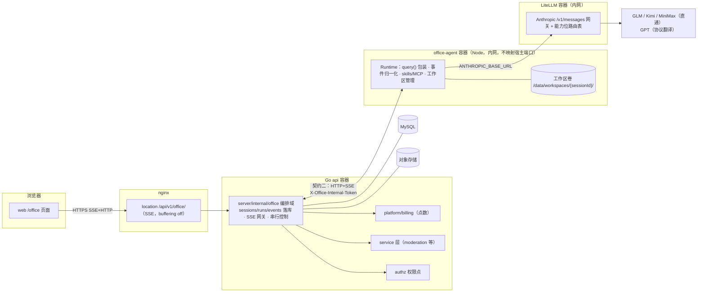
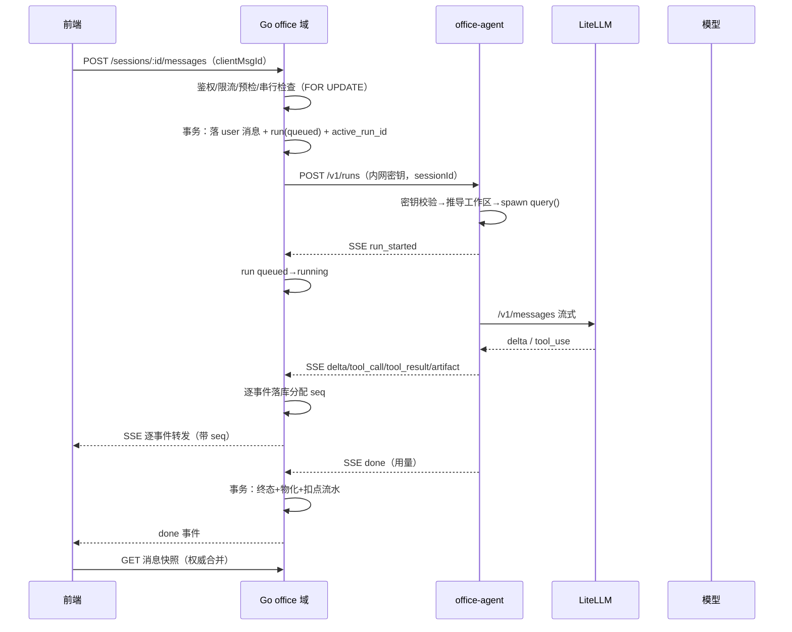
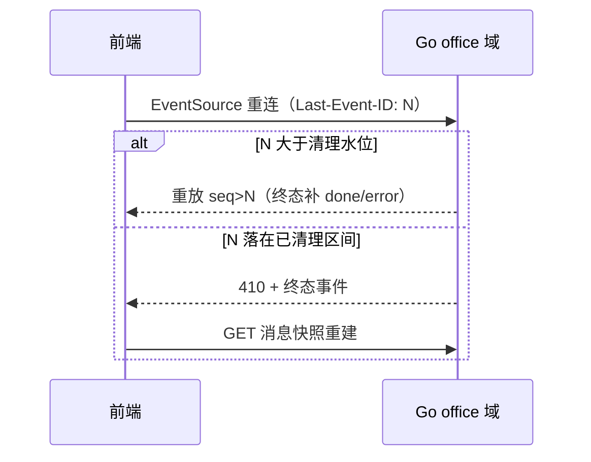

# 第六期技术设计：AI 办公助理（Agent 产品线）— Design

> 文档类型：Design（技术设计）。产品理由与范围见 `第六期-提案-proposal.md`；接口字段级规格见 `第六期-接口规格-spec.md`；执行任务板见 `records/plans/PLAN-OFFICE-AGENT.md`。总览基线 `第六期-AI办公助理Agent产品线.md`。本文为技术内容详版基线，与总览冲突时以本文为准。
> 状态：待评审。边界值均为待报批默认值（统一见总览「边界值默认值表」）。

## 1. 总体架构

### 架构关系图（只表达关系与流；过程步骤见 §3 关键路径）



### 三层两契约

- **契约一（前端 ↔ Go）**：业务 SSE 协议，信封带协议版本 `v` 与 `seq`；事件由 Go 落库后转发；断线 Last-Event-ID 重放；空洞返回 410 走快照重建。
- **契约二（Go ↔ Runtime）**：内网 HTTP+SSE，四个接口；认证 `X-Office-Internal-Token`（部署时随机生成注入两侧 env，常量时间比较）；Runtime 不映射宿主端口；**工作区路径由 sessionId 服务端推导（`/data/workspaces/{sessionId}/`，格式强校验 `^[a-z0-9][a-z0-9-]{17,39}$`），不接受外部传入**。SDK 细节不出 Node。

### 串行与扩展

- 同会话强制串行：Go 事务内 `SELECT ... FOR UPDATE` 会话行校验 `active_run_id`，存在活动 run → 409。
- M1–M3 **单实例部署**（office-agent 与 Go api 均单实例，与单机 compose 一致）；水平扩展移除至 M4+（需粘性路由 + 工作区存储化 + resume 寻址重设计）。

## 2. 组件设计

### 2.1 Go 编排域 `server/internal/office/`

```text
handler.go   # HTTP 端点 + MountOfficeRoutes（用户面 /api/v1/office/...，照 canvas 包模板）
service.go   # 编排：串行控制、run 生命周期、事件落库与 seq 分配、孤儿回收扫描、物化
runtime.go   # 契约二客户端：密钥头、POST /v1/runs（收 SSE）、cancel、status
events.go    # 事件信封/类型枚举/校验（与 office-agent 的 zod schema 字段一一对应）
billing.go   # 预检、run 中累计、终态扣减事务（调 platform/billing，不跨产品域 import）
model.go     # 表结构定义（8 张表）
office_test.go
```

要点：cmd/server/main.go 只做注入与路由组装；测试夹具与生产共用同一张路由表（仓库既有约定）；SSE 写出沿用第四期 `/api/v1/ai/` 的流式转发经验；限流用现有 middleware 限流器。

### 2.2 Node Runtime `office-agent/`

```text
src/index.ts      # express：POST /v1/runs、POST /v1/runs/:id/cancel、GET /v1/runs/:id、GET /healthz
src/auth.ts       # 内网密钥校验（crypto.timingSafeEqual）
src/run/          # query() 生命周期：spawn、AbortController、resume-per-turn（transcript 落盘/续接）
src/events/       # SDKMessage → 归一化事件（zod schema；映射表见 §2.3；M0 spike 实证完备性）
src/workspace.ts  # sessionId 推导工作区路径 + 正则强校验
src/skills/       # SKILL.md 扫描与加载（gray-matter 解析 frontmatter，canvas-agent skills store 模式）
src/mcp/          # MCP server 注册（@modelcontextprotocol/sdk，本期内置文件/搜索工具）
```

部署：独立 Dockerfile（照 canvas-agent），bun/npm 构建单进程 Node 22+；winston 结构化日志带 run_id/session_id。

### 2.3 SDK 事件 → 归一化事件映射（初版，M0 spike 逐类型实证）

| SDK 产出（@anthropic-ai/claude-agent-sdk `query()` 流） | 识别特征 | 归一化事件 | 备注 |
|---|---|---|---|
| system / subtype=init（session_id、model、tools、mcp_servers） | `type=system` | `run_started` | Go 由此迁移 queued→running |
| stream_event: content_block_delta（text_delta） | `type=stream_event` | `delta` | 需开启 partial messages 选项；M0 验证 |
| assistant content 块 type=thinking | thinking 块 | 本期不透传（预留 reasoning 事件） | 国产模型 thinking 行为不一，M0 观察 |
| assistant content 块 type=tool_use | tool_use 块 | `tool_call`（name/inputPreview） | input 全量落 events，preview 供 UI |
| user content 块 type=tool_result | tool_result 块 | `tool_result`（isError/outputPreview） | |
| result / subtype=success（usage、total_cost、num_turns） | `type=result` | `done`（usage 汇总） | done 事件 payload 含 tokens |
| result / subtype=error_* 或 is_error | `type=result` | `error(code=…)` | code 映射表进 spec |
| canUseTool 审批回调 | 权限请求 | M1：配置为自动放行 + 审计日志；结构化提问后续期 | 预留 `clarification` |
| message_delta 中的 usage 增量 | 流式 usage | `usage`（M3，周期 30s 节流） | run 中计费数据源 |

映射完备性 = M0 spike 出口条件之一：SDK 文档枚举的全部 message/block 类型在表中必须有行（透传/忽略/转换三选一，显式声明）。

### 2.4 LiteLLM 网关

路由表即配置（示例片段，M0 定稿）：

```yaml
model_list:
  - model_name: glm-5.3
    litellm_params: { model: anthropic/glm-5.3, api_base: https://open.bigmodel.cn/api/anthropic, api_key: os.environ/ZHIPU_KEY }
  - model_name: kimi-k3
    litellm_params: { model: anthropic/kimi-k3, api_base: https://api.moonshot.ai/anthropic, api_key: os.environ/MOONSHOT_KEY }
  - model_name: minimax-m3
    litellm_params: { model: anthropic/MiniMax-M3, api_base: https://api.minimax.io/anthropic, api_key: os.environ/MINIMAX_KEY }
  - model_name: gpt-5.6
    litellm_params: { model: openai/gpt-5.6, api_key: os.environ/OPENAI_KEY }   # 协议翻译路径
```

能力位（Go 侧配置实体，前端按位过滤）：`{ vision, context_tier(200k/1m), thinking(never/always/optional), server_tools }`。

### 2.5 前端 `web/src/pages/office/`

```text
index.tsx            # 布局：会话列表 + 对话流 + artifact 抽屉（antd Layout，主题走全局 token）
use-office-chat.ts   # 页面私有 hook：SSE fetch-stream 生命周期（D1 决策：Bearer 鉴权不可用原生 EventSource）/重连/410 降级/快照合并
components/          # 会话列表项、消息流、工具卡片、artifact 卡片（页面私有，不进全局目录）
```

**渲染管线**（对话流与 artifact 预览共用）：`delta 增量 buffer → markdown 解析（react-markdown + remark-gfm）→ rehype-sanitize 白名单净化 → 代码块 highlight.js 着色 → 公式 rehype-katex → 输出`。代码/JSON 类 artifact 详情用 Monaco 只读模式打开。html 类型 artifact 不渲染富内容（仅源码视图）。

### 2.6 渲染库选型（含 monaco / katex / hljs 详解）

| 库 | 是什么 | 本项目用途 | 期次 |
|---|---|---|---|
| **highlight.js (hljs)** | 通用代码语法高亮库，自动检测 190+ 语言并着色 | 对话流与 artifact 中代码块的着色渲染 | M1 |
| **katex** | 高速 LaTeX 数学公式渲染库（LaTeX 子集），输出排版级公式 | AI 输出中的行内/块级公式渲染（统计、金融、科研内容） | M1 |
| **monaco (Monaco Editor)** | 微软开源、VS Code 同内核的浏览器代码编辑器：语法高亮、补全、多光标、diff、JSON 校验 | 代码/JSON/YAML 类 artifact 的详情查看（M2 只读）；在线编辑能力 M4+ 评估（WorkBuddy 用法） | M2 |
| react-markdown + remark-gfm | markdown 解析渲染（GFM 表格/任务列表） | 对话流渲染管线入口 | M1 |
| rehype-sanitize | HTML 净化（白名单），模型生成内容的安全闸 | 渲染必经层（评审 F7 修复项） | M1 |
| rehype-katex | markdown 管线中接 katex 的桥接插件 | 与 katex 配套 | M1 |
| @monaco-editor/react | monaco 的 React 封装 | 前端 artifact 查看器 | M2 |
| eventsource（浏览器原生） | SSE 客户端，原生携带 Last-Event-ID 重连 | 契约一客户端 | M1 |

Node/Go/基础设施选型：

| 组件 | 选型 | 理由 |
|---|---|---|
| Agent Runtime 核心 | `@anthropic-ai/claude-agent-sdk`（版本锁定） | 现成 agent loop + 工具 + resume + skills；M0 spike 验证假设 |
| Runtime HTTP | express 5 | canvas-agent 同款，团队熟悉 |
| MCP | @modelcontextprotocol/sdk | 官方 SDK，canvas-agent 已用 |
| SKILL 解析 | gray-matter | frontmatter 解析，canvas-agent 已用 |
| 校验 | zod | Runtime 事件/配置校验，canvas-agent 已用 |
| 日志 | winston（Node）/ Go 现有日志设施 | 结构化 + run_id 贯穿 |
| 模型网关 | LiteLLM 官方镜像 | Anthropic `/v1/messages` 统一入口；退路自建 Go 翻译层 |
| Go 侧 | 零新增第三方依赖 | 全部复用 errs/httpx/middleware/db/storage/platform |

## 3. 关键路径时序（步骤表为基线；时序图与表不一致时以表为准）

### KP-1 发消息起 run（M1 核心链路）

| 步 | 责任方 | 动作 | 失败分支 |
|---|---|---|---|
| 1 | 前端 | `POST /api/v1/office/sessions/:id/messages`，body 含 `content` 与幂等键 `clientMsgId`（uuid） | E1 |
| 2 | Go | 鉴权（office.write）→ 限流 → 事务：`SELECT FOR UPDATE` 会话行校验无活动 run → 落 user 消息 → 建 `office_runs(queued)` → 回填 `active_run_id`；同 clientMsgId 重发返回既有 run | E2/E5 |
| 3 | Go | `POST office-agent /v1/runs`（密钥头；runId、sessionId、消息、agent 配置、附件清单） | E3 |
| 4 | Runtime | 校验密钥 → 推导工作区 → spawn `query()` → 返回 SSE 归一化事件流 | E4 |
| 5 | Go | 收 `run_started`：queued→running（**迁移主体 = Go**）；此后逐事件落库分配 seq 并转发 | E6/E7 |
| 6 | Runtime→LiteLLM→模型 | `/v1/messages` 流式 | E8 |
| 7 | Go | 收 `done/error`：事务 { 终态 + 清 active_run_id + 物化 assistant 消息（threadId/turnId/itemId）+ 扣减流水（UNIQUE run_id） } | E9 |
| 8 | 前端 | `done` 后拉消息快照，快照权威合并 | E10 |



### KP-2 断线重连与重放

| 步 | 责任方 | 动作 |
|---|---|---|
| 1 | 前端 | EventSource 重连自动带 `Last-Event-ID: <seq>` |
| 2 | Go | seq > 清理水位 → 从 `office_events` 重放 `seq > lastSeq`（run 已终态则重放至末尾补发终态事件） |
| 3 | Go | seq 落在已清理区间 → 410 + 终态事件，前端走快照重建 |
| 4 | 前端 | 按「消息物化与合并去重」（§5）合并 |



### KP-3 取消

| 步 | 责任方 | 动作 |
|---|---|---|
| 1 | 前端 | `POST /runs/:id/cancel` |
| 2 | Go | 已终态 → 幂等 200；queued → 直接置 cancelled；running → 转发 Runtime cancel（超时 E12） |
| 3 | Runtime | AbortController 中断 SDK，事件流 `error(code=cancelled)` 收尾 |
| 4 | Go | 落终态 + 物化已生成部分 + 照实扣减 |
| 5 | 判定 | 点击到事件流收尾 ≤ 2s（待报批），超出仅提示「取消已受理」 |

## 4. 异常矩阵

> 行 = 关键路径 × 失败模式；超时等数值统一见总览「边界值默认值表」（待报批）。

| 编号 | 失败模式 | 检测 | 处理 | 重试主体/次数/退避 | 幂等前提 | 用户可见 | 告警 |
|---|---|---|---|---|---|---|---|
| E1 | 同 clientMsgId 重复提交 | UNIQUE(session_id, client_msg_id) 冲突 | 返回既有 run 与事件流 | N/A（幂等命中） | clientMsgId | 无感 | N/A |
| E2 | 同会话并发提交 | active_run_id 非空 | 409 拒绝 | 用户手动 | — | 「上一条还在执行」 | N/A |
| E3 | Go→Runtime 起跑超时 | HTTP 超时（10s） | run failed(runtime_unreachable)，清 active_run_id | 用户手动 | clientMsgId | 错误气泡+重试 | runtime_unreachable |
| E4 | Runtime 崩溃/断连 | 契约二 SSE 断开 | run failed(runtime_lost)；TTL 兜底 | 用户手动 | clientMsgId | 「执行中断」 | runtime_lost |
| E5 | 计费预检不过 | 余额 ≤0（M1）/预估超余额（M3） | 400 拒绝，不建 run | 用户充值 | — | 「点数不足」 | N/A |
| E6 | 事件静默（模型停摆） | 120s 无任何事件 | Go 主动 cancel，failed(stalled) | 用户手动 | clientMsgId | 「生成超时已终止」 | stalled |
| E7 | Go→前端转发中断 | 客户端断开 | run 继续执行，事件照常落库；重连走 KP-2 | 客户端自动 | Last-Event-ID | 重连补齐 | N/A |
| E8 | LiteLLM/上游超时 | Runtime 请求超时（120s） | `error(upstream_timeout)` 收尾 | 用户手动/换模型 | clientMsgId | 错误气泡+建议换模型 | upstream 错误计数 |
| E9 | 扣减落库失败 | 终态事务报错 | 终态照落；扣减定时任务重试 | **系统** 5 次×60s，仍败转人工 | 流水 UNIQUE run_id | 不感知 | billing_fail |
| E10 | 重放与快照重复合并 | turnId 已物化判定 | 快照权威，事件仅补未物化 turn | — | turnId/itemId | 无感 | N/A |
| E11 | 重放命中已清理区间 | seq < 清理水位 | 410 + 终态事件，前端走快照 | N/A | — | 页面重建 | N/A |
| E12 | Runtime cancel 超时 | 转发超时（5s） | Go 强制置 cancelled；Runtime 侧孤儿 TTL 兜底 | N/A | cancel 幂等 | 「已取消」 | cancel_timeout |
| E13 | Go 崩溃重启 | 启动扫描：queued/running 且 updated_at 超 TTL（10min） | `GET /v1/runs/:id` 对账；无记录→failed(orphan_reclaimed)；仍在跑→强制 cancel+failed（M1 取舍，续转留 M4+） | N/A（系统回收） | 扫描按 runId 幂等 | 「执行中断」 | orphan_reclaimed |
| E14 | Runtime 自身重启 | 启动自检与 Go 对账 | 无状态重建，run 由 Go 侧判定 | 同 E13 | — | 同 E13 | 同 E13 |

## 5. 数据模型（8 张表）

| 表 | 关键字段与约束 |
|---|---|
| office_sessions | id、user_id、agent_id、title、workspace_path、active_run_id（可空唯一索引）、status、created_at |
| office_runs | id、session_id、status、model、error_code、client_msg_id（UNIQUE(session_id, client_msg_id)）、started_at、finished_at、tokens、点数汇总 |
| office_events | BIGINT 自增、run_id、seq、type、payload JSON；UNIQUE(run_id, seq)；终态 7 天后清理 |
| office_messages | id、session_id、role、content JSON（含 schema_version）、run_id、thread_id、turn_id、created_at |
| office_artifacts | id、session_id、run_id、kind、name、storage_key、size、mime |
| office_files | id、session_id、user_id、storage_key、mime、size |
| office_agents | id、name、avatar、description、system_prompt、model、tools JSON、skills JSON、visibility、enabled |
| office_skills | id、slug、version、name、description、frontmatter JSON、storage_key、enabled |

事务边界：步骤 2 与步骤 7 各为单事务；`active_run_id` 由会话行锁保护；流水 UNIQUE(run_id) 幂等。交付前真实 MySQL 迁移验证（仓库硬性要求）。协议版本（信封 `v`）与存储版本（schema_version）独立管理。

## 6. 计费闭环（复用一律经 platform/billing 与 service 层）

| 环节 | 规则 |
|---|---|
| 预检 | M1 余额 ≤0 拒绝；M3 增加预估折点 |
| run 中检测 | M3：usage 事件 30s 节流累计，超余额走 KP-3 取消 + `quota_exhausted` |
| 终态扣减 | 与终态同事务；UNIQUE(run_id) 幂等；失败系统重试 5×60s 转人工（E9） |
| 失败 run | 已耗 token 照实计费（以 Runtime 上报累计 usage 为准）；崩溃窗口丢失用量不追补不收取 |
| 计量口径 | 自算（官方单价表配置化）为准；LiteLLM cost 对账门禁：抽样偏差 ≤5%，否则永久自算 |

## 7. 消息物化与合并去重

- 归属键：thread_id=session_id、turn_id=run_id、id=itemId（对齐仓库 agent 消息硬规则）。
- 快照权威：run 终态时 Go 物化 assistant 消息；SSE 事件只补未物化 turn 的实时展示。
- 前端合并：按 turnId 判已物化 → 重放事件只恢复过程卡片；未物化 → 按 seq 顺序追加；历史加载只信快照。

## 8. 可观测性与安全

- 日志：Go 现有结构化日志 + office-agent winston，四跳贯穿 run_id/session_id/user_id；LiteLLM request 头透传 run_id。
- 指标：run 终态分桶、首 token 延迟、事件间隔、各跳错误、计费失败、孤儿回收。
- 告警：runtime_unreachable / stalled / orphan_reclaimed / billing_fail / cancel_timeout 任一持续出现即人工介入。
- 安全：模型 key 服务端保管；office-agent/LiteLLM 内网 only；契约二密钥认证；路径服务端推导 + 强校验；渲染净化白名单；html artifact 不渲染富内容；权限默认仅内测角色。

## 9. 发布与回滚

| 里程碑 | 发布形态 | 回滚点（下线顺序） |
|---|---|---|
| M1 | 内测角色可见 | ① 前端入口 flag 隐藏 → ② nginx 摘 location → ③ compose 停 agent/LiteLLM → ④ 表保留 |
| M2 | + 工具能力 | ① agents.tools 置空 → ② 同 M1 |
| M3 | + 多模型计费 | ① 权限点回收（全量 403）→ ② 同 M1；计费单独回滚 = 关计费开关，流水不回冲人工对账 |

## 10. 验收指针（不自造第二套标准）

各里程碑验收标准唯一来源：总览文档 M0–M3 验收清单 + `records/tests/` 测试计划（test-planner 产出）。本文不另行定义验收数字；接口级可观测断言以 spec「验证命令」为准。
